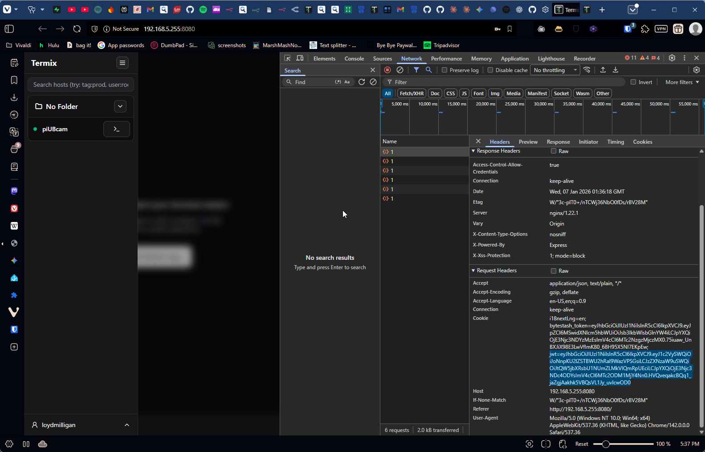

# Mashb0ard

> A personal browser dashboard and command center for self-hosted environments

## Overview

Mashb0ard is a keyboard-driven new tab replacement that consolidates daily tools into one workspace. It's a desktop-first React SPA with embedded service integrations, designed for power users who self-host their services.

## Features

### Core Features
- **Split Layout**: 40/60 draggable split with left panel (tools, links, dashboard) and right content area (tabbed apps)
- **Resizable Sidebars**: Drag-to-resize AI chat and notes sidebars
- **Integrated Apps**: Termix (SSH), ByteStash (snippets), SearXNG (search) as embedded tabs
- **AI Chat**: OpenRouter-powered chat sidebar with model selection, streaming toggle, and thinking animations
- **Notes**: Dumbpad for quick notes + NoteMark for full markdown notebooks
- **Workflows**: Quick-launch URL groups (macros)
- **Quick Links**: Organized link groups with collapsible sections
- **Command Palette**: Keyboard-driven actions (`Cmd+K`)
- **Dark/Light Theme**: System-aware theming

### Task Management
- **Vikunja Integration**: Full task management with priorities, due dates, and projects
- **Pomodoro Timer**: Built-in timer in header with task claiming
- **Task Resources**: Attach resources to tasks that auto-open when claimed:
  - Web links (iframe embeds)
  - YouTube videos
  - Files (images, PDFs, code, audio, spreadsheets)
  - NoteMark notes
  - SSH connections (Termix)

### Productivity Tools
- **Container Logs**: Dozzle integration for viewing Docker container logs
- **Code Snippets**: ByteStash for storing and organizing code snippets
- **Search**: SearXNG privacy-respecting search with results opening in new tabs
- **Habits Tracker**: Track daily habits with streaks and statistics

## Screenshots



## Tech Stack

| Layer | Technology |
|-------|------------|
| Framework | React 18 + TypeScript |
| Build | Vite |
| Styling | Tailwind CSS |
| Components | shadcn/ui (Radix primitives) |
| State | Zustand (with persist middleware) |
| Icons | Lucide React |
| Deployment | Docker + nginx reverse proxy |

---

## Deployment

### Quick Start (Docker - Recommended)

The easiest way to run Mashb0ard with all integrated services:

```bash
# 1. Clone the repository
git clone https://github.com/youruser/mashboard.git
cd mashboard

# 2. Copy and configure environment variables
cp docker/.env.example docker/.env
# Edit docker/.env with your preferred settings

# 3. Build and start all services
docker compose -f docker/docker-compose.proxy.yml up -d --build

# 4. Access Mashb0ard
open http://localhost:3000
```

### What Gets Deployed

The Docker setup includes:

| Service | URL | Description |
|---------|-----|-------------|
| **Mashb0ard** | http://localhost:3000 | Main dashboard |
| **Mashboard API** | http://localhost:3000/api/mashboard/ | Backend API (habits, task resources) |
| **Vikunja** | http://localhost:3000/vikunja/ | Task management (API at /api/vikunja/) |
| **NoteMark** | http://localhost:3000/notemark/ | Markdown notebooks (API at /api/notemark/) |
| **Dumbpad** | http://localhost:3000/dumbpad/ | Quick notes (embedded in sidebar) |
| **Termix** | http://localhost:3000/termix/ | SSH terminal (content tab) |
| **ByteStash** | http://localhost:3000/bytestash/ | Code snippets (content tab) |
| **SearXNG** | http://localhost:3000/searxng/ | Privacy search (content tab) |
| **Dozzle** | http://localhost:3000/dozzle/ | Docker container logs |

### Initial Configuration

After deployment, open Settings (`Cmd+,` or click gear icon) and configure:

**API Keys Tab:**
| Setting | Value |
|---------|-------|
| OpenRouter API Key | Your key from [openrouter.ai/keys](https://openrouter.ai/keys) |
| Vikunja API URL | `/api/vikunja` |
| Vikunja API Token | Generate in Vikunja Settings → API Tokens |
| Vikunja Iframe URL | `/vikunja` |
| Dumbpad Base URL | `/dumbpad` |
| Termix Iframe URL | `/termix` |
| Termix API Base URL | `/api/termix` |
| Termix JWT Token | Copy from Termix (F12 → Application → Cookies → `jwt`) |
| NoteMark API URL | `/api/notemark` |
| NoteMark Iframe URL | `/notemark` |
| ByteStash URL | `/bytestash` |
| SearXNG URL | `/searxng` |

### Environment Variables

Key variables in `docker/.env`:

```bash
# General
PORT=3000                              # Port to expose
EXTERNAL_URL=http://localhost:3000     # Your domain (for callbacks)

# Vikunja
VIKUNJA_SERVICE_JWTSECRET=change-me    # JWT secret (CHANGE THIS!)
VIKUNJA_SERVICE_FRONTENDURL=http://localhost:3000/vikunja

# NoteMark
NOTEMARK_DATA_DIRECTORY=/data          # Data storage path

# Dumbpad
DUMBPAD_PIN=                           # Optional PIN protection
DUMBPAD_TITLE=Notes                    # Tab title

# Termix
TERMIX_SALT=change-me-to-random        # Encryption salt (CHANGE THIS!)

# ByteStash
BYTESTASH_JWT_SECRET=change-me         # JWT secret (CHANGE THIS!)
BYTESTASH_ALLOW_NEW_ACCOUNTS=true      # Allow registrations

# SearXNG
SEARXNG_INSTANCE_NAME=Mashb0ard Search # Instance name
```

### Production Deployment

For production with a custom domain:

```bash
# 1. Update EXTERNAL_URL in docker/.env
EXTERNAL_URL=https://dashboard.yourdomain.com

# 2. Use a reverse proxy (Traefik, Caddy, nginx) in front
# Example with Traefik labels in docker-compose

# 3. Update service BASE_URLs to match your domain
```

### Updating

```bash
cd mashboard
git pull
docker compose -f docker/docker-compose.proxy.yml up -d --build
```

### Stopping

```bash
docker compose -f docker/docker-compose.proxy.yml down
# Add -v to also remove volumes (data)
```

---

## Development

### Prerequisites

- Node.js 18+
- npm or pnpm

### Local Development

```bash
# Install dependencies
npm install

# Start dev server
npm run dev
# Opens at http://localhost:5173

# Build for production
npm run build

# Preview production build
npm run preview
```

### Project Structure

```
src/
├── components/
│   ├── features/      # Feature components (ai-chat, notes, search, etc.)
│   ├── layout/        # Layout components (Header, SplitLayout, panels)
│   ├── shared/        # Shared components (ServiceIframe)
│   └── ui/            # shadcn/ui components
├── hooks/             # Custom React hooks
├── stores/            # Zustand stores
├── services/          # API clients (OpenRouter, Termix)
├── types/             # TypeScript definitions
└── lib/               # Utilities (cn, constants)
```

---

## Keyboard Shortcuts

| Shortcut | Action |
|----------|--------|
| `Cmd+K` | Open command palette |
| `Cmd+/` | Toggle AI chat sidebar |
| `Cmd+Shift+N` | Toggle notes sidebar |
| `Cmd+\`` | Open Termix tab |
| `Cmd+Shift+B` | Open ByteStash tab |
| `Cmd+E` | Focus search bar |
| `Cmd+,` | Open settings |

---

## Architecture

### Services Integration

All services run behind an nginx reverse proxy on the same origin, which:
- Solves third-party cookie issues for iframe embedding
- Provides unified access through a single port
- Handles WebSocket upgrades for real-time features

### State Management

- **Zustand** stores with `persist` middleware for localStorage
- Automatic state rehydration on page load
- Separate stores for: settings, UI, content tabs, workflows, chat

### Security Notes

- API keys stored in browser localStorage (acceptable for single-user self-hosted)
- Services should be behind authentication if exposed to internet
- Change default salts/secrets in production

---

## Documentation

- [CLAUDE.md](CLAUDE.md) - AI assistant instructions
- [DESIGN.md](DESIGN.md) - Design philosophy
- [FEATURES.md](FEATURES.md) - Feature specifications

---

## Troubleshooting

### Services not loading in tabs

1. Check service URLs in Settings match the proxy paths
2. Verify services are running: `docker compose -f docker/docker-compose.proxy.yml ps`
3. Check nginx logs: `docker logs mashb0ard`

### Termix authentication issues

1. Termix requires a JWT token for API calls
2. Open Termix directly (`/termix/`), log in
3. Copy the `jwt` cookie value to Settings

### Dumbpad buttons not working

This is usually a path issue. Ensure:
- Dumbpad URL is set to `/dumbpad` (not `/dumbpad/`)
- The nginx proxy is correctly routing `/js/`, `/css/`, `/api/` paths

### SearXNG not loading

1. First-time setup takes a moment to initialize
2. Check container logs: `docker logs searxng`
3. Verify `/searxng/` is accessible directly

---

## License

MIT
